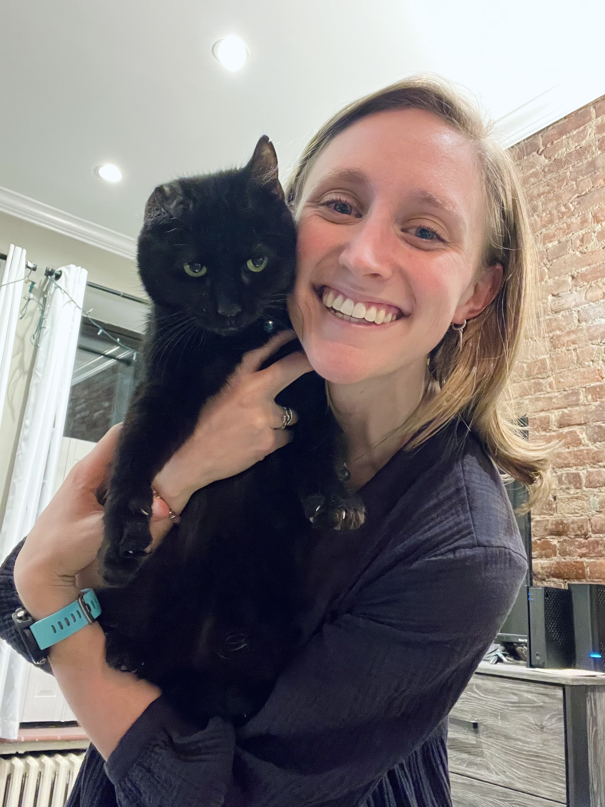

<br/>

```{r, out.width = "400px", echo = FALSE, fig.align = 'center'}
knitr::include_graphics("images/emma_hiking.jpg")
```
<center>
Hiking in the Swiss Alps, 2017
</center>

<br/>

### Introduction

Hello! Welcome to my personal website. My name is Emma Sexton and I am currently a graduate student at Columbia University Mailman School of Public Health. 

I am currently studying Public Health Research Methods within the Heilbrunn Department of Population and Family Health. I hope to use my experience and expertise in mixed methods research to investigate critical periods of the life course, particularly the intersection of pregnancy and early child development. 

Aside from being a student, I love to knit, hike, and run. In fact, I am an avid runner and I will be running the New York City Marathon this coming weekend (my first marathon!). :) I also own the cutest cat (Wilson, pictured below - enjoy!).

If you're interested in learning more about me and my background, feel free to review my [resume](experience.html). 


```{r, out.width = "400px", echo = FALSE, fig.align = 'center'}

```
<center>
Me and Wilson, 2022
</center>
